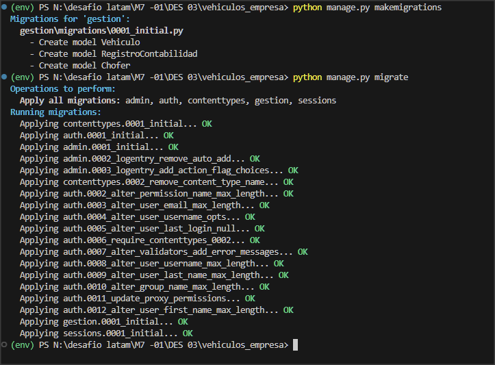
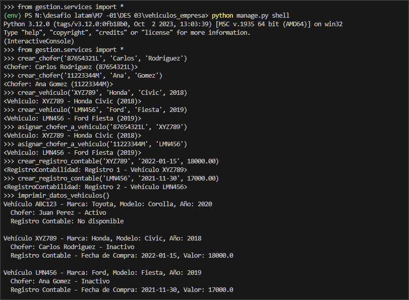
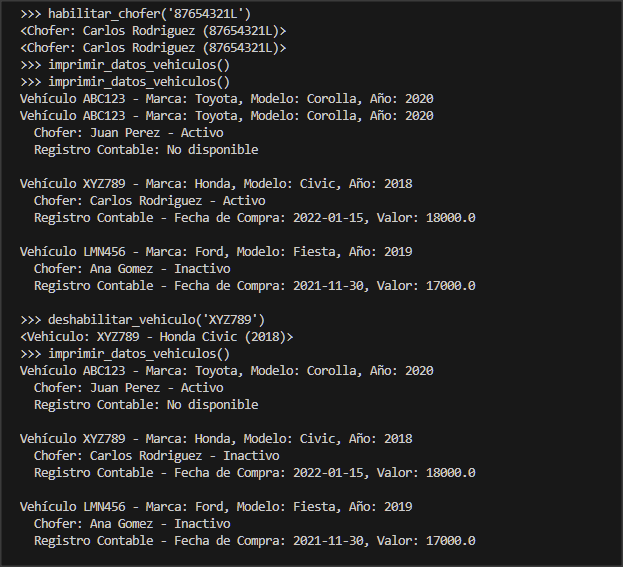

# Desafío Guiado - Vehículos Empresa

Este proyecto es un desafío guiado para la gestión de vehículos de una empresa, donde se manejan vehículos utilitarios de reparto asignados a choferes. El proyecto incluye la creación de modelos y servicios para gestionar vehículos, choferes y registros contables.

## Descripción

El proyecto consiste en desarrollar un sistema básico de gestión de vehículos para una empresa. Incluye la creación de modelos con relaciones y servicios para realizar operaciones con los datos almacenados en la base de datos.

## Modelos

Detalles de los modelos `Vehiculo`, `Chofer` y `RegistroContabilidad`.

## Servicios

Descripción de las funciones creadas en `services.py` para gestionar vehículos, choferes y registros contables.

## Pruebas

